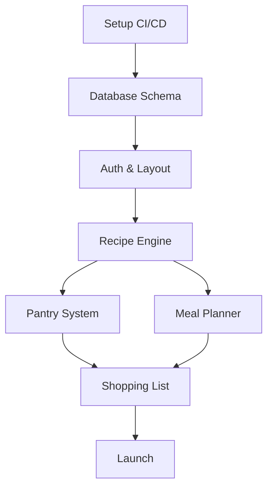

# CookWise Project Plan

**Goal**: Build an AI-Powered Kitchen Operating System that streamlines recipe management, pantry tracking, and meal planning.
**Timeline**: estimated 8 weeks
**Team**: Full Stack Developer (User + AI Pair)

---

## Skill Integration Strategy

*   **`project-planner`**: Used to structure this document and track progress.
*   **`github-actions-templates`**: Will be used to set up CI/CD pipelines in Phase 1.
*   **`vercel-react-best-practices`**: Applied during implementation of all React components, specifically for image handling and data fetching.
*   **`web-design-guidelines`**: Used for UI/UX review before completing each frontend task.

---

## Milestones

| # | Milestone | Target | Description |
|---|-----------|--------|-------------|
| 1 | **Foundation & CI/CD** | Week 1 | Repo setup, CI pipelines, DB schema, basic auth. |
| 2 | **Recipe Engine** | Week 2-3 | CRUD recipes, AI parsing (Gemini), Image OCR. |
| 3 | **Smart Pantry** | Week 4-5 | Inventory management, expiration tracking, barcode lookup. |
| 4 | **Planner & Shopping** | Week 6-7 | Drag-and-drop meal plan, auto-shopping list, "Cook Mode". |
| 5 | **Launch Polish** | Week 8 | UI audit, performance tuning, PWA features. |

---

## Phase 1: Foundation & Infrastructure

**Focus**: Setting up a robust development environment and automated workflows.

| Task ID | Task Name | Skill / Tech | Definition of Done |
|:-------:|-----------|--------------|--------------------|
| P1-T1 | **CI/CD Pipeline Setup** | `github-actions-templates` | Actions for linting, testing, and build checks are active. |
| P1-T2 | **Database Initialization** | Prisma / Postgres | Schema applied, local DB running, seed script created. |
| P1-T3 | **Authentication Flow** | NextAuth.js | Google Auth working, protected routes established. |
| P1-T4 | **Design System Setup** | Tailwind / shadcn | Theme tokens defined, layout components created. |

**Risks**: Database connection issues in CI. *Mitigation*: Use service containers in GitHub Actions.

---

## Phase 2: Recipe Engine (The Core)

**Focus**: Ingesting and displaying recipes using AI.

| Task ID | Task Name | Skill / Tech | Definition of Done |
|:-------:|-----------|--------------|--------------------|
| P2-T1 | **Recipe Data Model** | Prisma | Models for Recipe, Ingredient, Instruction created. |
| P2-T2 | **AI Parsing Service** | Gemini API | Server action to extract JSON from text/URL (per `docs/03-ai-prompts.md`). |
| P2-T3 | **Recipe View UI** | `vercel-react-best-practices` | Optimized images (`bundle-dynamic-imports`), responsive layout. |
| P2-T4 | **Manual Entry Form** | React Hook Form | Complex form for editing ingredients/steps. |
| P2-T5 | **Image OCR Integration** | Gemini Vision | Upload image -> Parse text -> Auto-fill form. |

**Performance Rule**: Use `server-cache-react` for recipe data to minimize DB hits on high-traffic pages.

---

## Phase 3: Smart Pantry & Interaction

**Focus**: Managing inventory and linking it to recipes.

| Task ID | Task Name | Skill / Tech | Definition of Done |
|:-------:|-----------|--------------|--------------------|
| P3-T1 | **Pantry Schema & API** | Prisma | PantryItem model with expiration and status logic. |
| P3-T2 | **Inventory Dashboard** | Recoil / Zustand | Real-time view of stock levels with optimistic updates. |
| P3-T3 | **Barcode Scanner** | QuaggaJS / API | Scan barcode -> fetch product metadata. (Done via `@yudiel/react-qr-scanner`) |
| P3-T4 | **Recipe-Pantry Matching** | Logic | "Can I cook this?" indicator based on stock. |

**Design Rule**: Audit pantry dashboard using `web-design-guidelines` for accessibility of status indicators.

---

## Phase 4: Meal Planner & Shopping List

**Focus**: The "Operating System" aspect - connecting recipes to time and procurement.

| Task ID | Task Name | Skill / Tech | Definition of Done |
|:-------:|-----------|--------------|--------------------|
| P4-T1 | **Drag-and-Drop Planner** | dnd-kit | Calendar view to schedule recipes for meal slots. |
| P4-T2 | **Shopping List Gen** | Logic | Planner + Pantry delta = Shopping List. |
| P4-T3 | **Shopping Mode** | PWA / Wake Lock | Mobile-first view with wake lock (User Flow Step 2). |
| P4-T4 | **Cooking Mode** | PWA / Wake Lock | Step-by-step view with timers and voice controls. |

---

## Phase 5: Verification & Launch

**Focus**: Polish, performance, and user acceptance.

| Task ID | Task Name | Skill / Tech | Definition of Done |
|:-------:|-----------|--------------|--------------------|
| P5-T1 | **UI/UX Audit** | `web-design-guidelines` | Full pass on all pages for consistency and a11y. |
| P5-T2 | **Performance Tuning** | `vercel-react-best-practices` | Lighthouse score > 90, eliminate waterfall requests. |
| P5-T3 | **End-to-End Testing** | Playwright | Critical flows (Auth -> Cook -> Shop) verified. |
| P5-T4 | **Documentation** | `documentation-engineer` | Final logic documentation and user guides. |

---

## Dependencies Map

